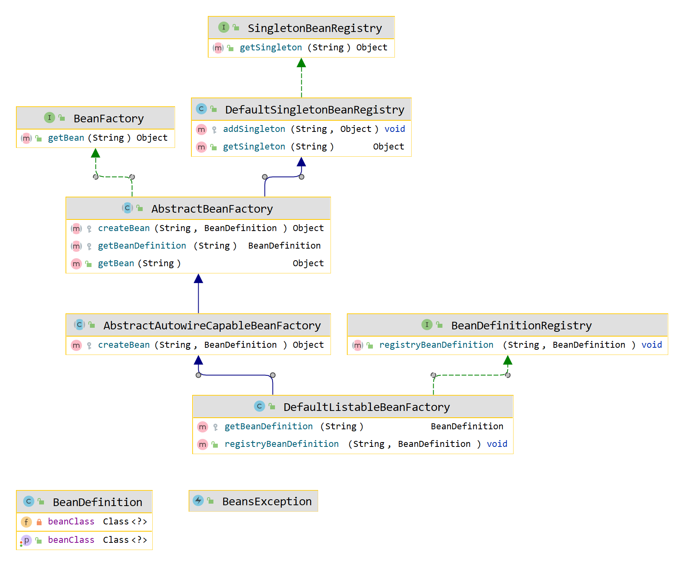

# 学习Spring源码 基础

1. BeanDefinition的定义： 一个bean的成员变量为该类的Class对象
2. BeanFactory接口定义：通过该beanName获取bean实例
3. SingletonBeanRegistry接口定义：获取单例
4. DefaultSingletonBeanRegistry  SingletonBeanRegistry接口的默认实现，一个Map实例存储对象
5. AbstractBeanFactory抽象模板类，抽象出需要提供给外面实现的方法，将流程定义出来
6. AbstractAutowireCapableBeanFactory  AbstractBeanFactory的部分实现，具有创建单例Bean的能力

BeanDefinition 是定义一个组件的核心类，所有的组件信息都要被定义出来 即Class
对象

这里只是实现一个单例注册, 拿到BeanDefinition并定义到Map

既要一个Map中拿到BeanDefinition, 也要从BeanDefinition中拿到Class实例化对象到Map中去。